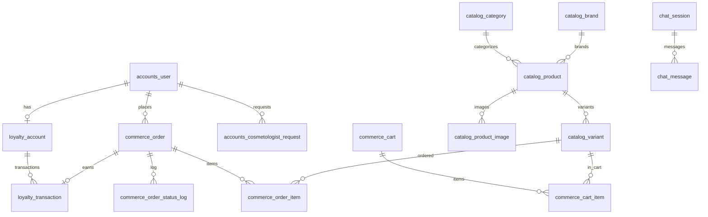

# Схема БД — SVbeauty

Договір № 0508202602 + доп. угода (кабінет, dual-price, лояльність, uk/ru).
Стек: Django 5 + PostgreSQL (prod) / SQLite (dev).

## Конвенції

| Правило | Значення |
|---|---|
| PK | `BigAutoField` |
| Час | `created_at`, `updated_at` (TIMESTAMPTZ) через `TimeStampedModel` |
| Гроші | `Decimal(10,2)`, валюта — UAH |
| Відсотки | `Decimal(5,2)` |
| Слаг | `SlugField(255)`, **один на сутність** (мова лише в префіксі URL) |
| i18n | явні поля `*_uk` / `*_ru`; без modeltranslation |
| SEO | `seo_title_*`, `seo_description_*` через `SeoModel` mixin |
| Префікс таблиць | app label (`catalog_product`) |

Абстрактні моделі в `apps/core/models.py`: `TimeStampedModel`, `SeoModel`, `PublishedModel`.

---

## ER (ядро)



---

## 1. accounts

### `accounts_user` (AUTH_USER_MODEL)

Успадковує `AbstractUser`, логін по email.

| Поле | Тип | Опис |
|---|---|---|
| `email` | EmailField, unique | логін |
| `username` | — | не використовується (`USERNAME_FIELD = email`) |
| `first_name`, `last_name` | Char(150) | ПІБ |
| `phone` | Char(32), blank | телефон |
| `client_type` | Char(16), choices | `regular` / `pending_cosmo` / `cosmetologist` |
| `client_type_changed_at` | DateTime, null | коли адмін змінив статус |
| `is_active`, `is_staff` | Bool | стандарт Django |

**Правило:** `client_type` редагується **лише staff** в адмінці. Форми фронтенду це поле не приймають.

`is_pro` (property) = `client_type == "cosmetologist"`.

Індекси: `email` (unique), `phone`, `client_type`.

### `accounts_cosmetologist_request`

Заявка «стати косметологом».

| Поле | Тип | Опис |
|---|---|---|
| `user` | FK → user | автор |
| `full_name` | Char(160) | ПІБ |
| `phone` | Char(32) | контакт |
| `workplace` | Char(255), blank | салон / кабінет |
| `document` | FileField, blank | сертифікат / диплом |
| `comment` | Text, blank | коментар клієнта |
| `status` | Char(16) | `new` / `approved` / `rejected` |
| `admin_note` | Text, blank | нотатка менеджера |

Схвалення в адмінці → `user.client_type = cosmetologist`.

---

## 2. catalog

### `catalog_brand`

| Поле | Тип |
|---|---|
| `name` | Char(120) |
| `slug` | Slug, unique |
| `description_uk`, `description_ru` | Text, blank |
| `is_active` | Bool |
| `sort_order` | Int |

Seed: `Cure Skin`, `Great Care`, `Proactive Skin` (останній без товарів).

### `catalog_category`

| Поле | Тип |
|---|---|
| `name_uk`, `name_ru` | Char(120) |
| `slug` | Slug, unique |
| `image` | Image, blank (круг на головній) |
| `description_uk`, `description_ru` | Text, blank |
| `seo_*` | SeoModel |
| `is_active` | Bool |
| `sort_order` | Int |

Фікс seed-категорій:

| Назва (uk) | slug |
|---|---|
| Пілінги | `pilinhy` |
| Очищення | `ochyshchennya` |
| Тонізація | `tonizatsiya` |
| Сироватки | `syrovatky` |
| Маски | `masky` |
| Креми | `kremy` |
| Очі | `ochi` |
| SPF | `spf` |

### `catalog_product`

| Поле | Тип | Опис |
|---|---|---|
| `brand` | FK → brand | бренд |
| `category` | FK → category | одна категорія (ТЗ не вимагає M2M) |
| `name_uk`, `name_ru` | Char(255) | назва |
| `slug` | Slug, unique | URL |
| `short_description_uk/_ru` | Char(300), blank | під карткою |
| `description_uk/_ru` | Text, blank | повний опис |
| `ingredients_uk/_ru` | Text, blank | склад |
| `is_hit`, `is_new` | Bool | бейджі |
| `is_active` | Bool | публікація |
| `sort_order` | Int | порядок |
| `seo_*` | SeoModel | мета |

Властивості: `min_price`, `has_variants`, `main_image`.

### `catalog_variant`

Об'єм = модифікація. **Ціна живе тут.**

| Поле | Тип | Опис |
|---|---|---|
| `product` | FK → product | товар |
| `sku` | Char(64), unique | артикул з прайсу |
| `volume` | Char(32) | `50 мл`, `25 г` |
| `purchase_price_uah` | Decimal(10,2), default 0 | закупівельна; вводиться в адмінці, на сайті не показується |
| `price_uah` | Decimal(10,2), default 0 | роздріб; авто від націнки або вручну |
| `price_is_manual` | Bool, default False | True → автоперерахунок не чіпає `price_uah` |
| `price_pro_uah` | Decimal(10,2), default 0 | ціна для косметологів; авто від націнки або вручну |
| `price_pro_is_manual` | Bool, default False | True → автоперерахунок не чіпає `price_pro_uah` |
| `stock_qty` | Int, default 0 | залишок |
| `is_active` | Bool | |
| `sort_order` | Int | |

`in_stock` = `stock_qty > 0`.

### `catalog_product_image`

| Поле | Тип |
|---|---|
| `product` | FK |
| `image` | ImageField |
| `alt_uk`, `alt_ru` | Char(255), blank |
| `is_main` | Bool |
| `sort_order` | Int |

---

## 3. pricing

### `pricing_settings` (singleton)

| Поле | Тип | Опис |
|---|---|---|
| `retail_markup_percent` | Decimal(6,2), default 100 | націнка на роздріб від закупівельної |
| `pro_markup_percent` | Decimal(6,2), default 40 | націнка для косметологів від закупівельної |
| `rounding_step` | Char(8), default `1.00` | крок округлення: `0.01` / `1.00` / `5.00` / `10.00` |
| `pro_delivery_note_uk/_ru` | Text, blank | умови доставки для pro |
| `pro_min_order_uah` | Decimal(10,2), null | мінімальне замовлення pro |
| `retail_delivery_note_uk/_ru` | Text, blank | умови доставки роздріб |
| `free_delivery_from_uah` | Decimal(10,2), null | безкоштовна доставка роздріб |
| `free_delivery_from_pro_uah` | Decimal(10,2), null | те саме для pro |

### Розрахунок цін

Ціни зберігаються у варіанті, а не рахуються на льоту. Перед кожним
`Variant.save()` спрацьовує `apply_auto_prices()`:

```
if not variant.price_is_manual:
    variant.price_uah = round_to(purchase * (1 + retail_markup/100), rounding_step)
if not variant.price_pro_is_manual:
    variant.price_pro_uah = round_to(purchase * (1 + pro_markup/100), rounding_step)
```

`get_price(variant, user)` лише обирає потрібне поле:

```
if user is authenticated and user.client_type == "cosmetologist":
    return (variant.price_pro_uah, "pro_manual" if price_pro_is_manual else "pro_auto")
return (variant.price_uah, "retail")
```

Гість / `regular` / `pending_cosmo` → завжди роздріб.
`price_source` фіксується в `commerce_order_item`, разом із закупівельною
ціною на момент замовлення (`unit_purchase_price_uah`) — для звітів по маржі.
Override % по бренду або категорії — **не в цьому релізі**.

---

## 4. loyalty

### `loyalty_settings` (singleton)

| Поле | Тип | Опис |
|---|---|---|
| `is_enabled` | Bool | вимикач програми |
| `earn_points_per_uah` | Decimal(6,4) | балів за 1 грн (напр. 0.05) |
| `redeem_uah_per_point` | Decimal(6,2) | грн за 1 бал (напр. 1.00) |
| `max_redeem_percent` | Decimal(5,2) | ліміт списання від суми (напр. 30) |
| `earn_for_pro` | Bool | чи нараховувати косметологам |

### `loyalty_account`

| Поле | Тип |
|---|---|
| `user` | OneToOne → user |
| `balance` | Int, default 0 |

Зміни балансу — **лише** через `LoyaltyService` з `select_for_update()`.

### `loyalty_transaction`

| Поле | Тип | Опис |
|---|---|---|
| `account` | FK → loyalty_account | |
| `order` | FK → commerce_order, null | джерело |
| `kind` | Char(16) | `earn` / `redeem` / `manual` |
| `points` | Int | + нарахування, − списання |
| `balance_after` | Int | стан після операції |
| `comment` | Char(255), blank | |

Constraint: `unique(order, kind)` — захист від подвійного нарахування.

---

## 5. commerce

### `commerce_cart`

| Поле | Тип |
|---|---|
| `session_key` | Char(64), index |
| `user` | FK → user, null |
| `status` | Char(16): `active` / `converted` / `abandoned` |

### `commerce_cart_item`

| Поле | Тип |
|---|---|
| `cart` | FK |
| `variant` | FK → catalog_variant |
| `quantity` | PositiveInt |

`unique(cart, variant)`. Ціна **не зберігається** — рахується на льоту.

### `commerce_order`

| Поле | Тип | Опис |
|---|---|---|
| `number` | Char(20), unique | напр. `SV-260824-0001` |
| `user` | FK → user, null | гість = null |
| `client_type` | Char(16) | snapshot ролі на момент покупки |
| `first_name`, `last_name` | Char(150) | |
| `phone` | Char(32) | |
| `email` | Email | |
| `delivery_city`, `delivery_city_ref` | Char | НП |
| `delivery_branch`, `delivery_branch_ref` | Char | відділення / поштомат |
| `payment_method` | Char(16) | `bank_details` / `liqpay` |
| `status` | Char(20) | статуси нижче |
| `subtotal_uah` | Decimal(10,2) | сума позицій |
| `loyalty_spent_points` | Int | списано балів |
| `loyalty_discount_uah` | Decimal(10,2) | знижка від балів |
| `total_uah` | Decimal(10,2) | до сплати |
| `bank_details_snapshot` | JSON | реквізити на момент замовлення |
| `comment` | Text, blank | |
| `gdpr_accepted` | Bool | згода |
| `locale` | Char(2) | `uk` / `ru` |

Статуси: `new`, `processing`, `awaiting_payment`, `paid`, `shipped`, `done`, `canceled`.

### `commerce_order_item`

| Поле | Тип | Опис |
|---|---|---|
| `order` | FK | |
| `variant` | FK → variant, null (SET_NULL) | |
| `product_name` | Char(255) | snapshot |
| `sku`, `volume` | Char | snapshot |
| `unit_price_uah` | Decimal(10,2) | ціна за одиницю |
| `unit_purchase_price_uah` | Decimal(10,2), null | закупівельна на момент замовлення |
| `price_source` | Char(10) | `retail` / `pro_auto` / `pro_manual` |
| `quantity` | PositiveInt | |
| `line_total_uah` | Decimal(10,2) | |

### `commerce_order_status_log`

`order`, `old_status`, `new_status`, `changed_by` (FK user, null), `created_at`.

---

## 6. shipping

### `shipping_settings` (singleton)

| Поле | Тип |
|---|---|
| `np_api_key` | Char(255), blank |
| `use_test_data` | Bool |

Без ключа — фолбек на фікстуру `shipping/fixtures/np_test_branches.json`.
ТТН у цьому релізі не створюємо (поза ТЗ).

---

## 7. payments

Реквізити в `content_site_settings` (нижче) — окремої таблиці не заводимо.
LiqPay: адаптер + `LIQPAY_ENABLED` (env). Без ключів кнопка не показується.

---

## 8. content

### `content_site_settings` (singleton)

| Група | Поля |
|---|---|
| Бренд | `site_name`, `logo` (default `images/logo.png`), `accent_color` |
| Контакти | `phone`, `email`, `viber`, `telegram`, `whatsapp`, `instagram` |
| Промо-смуга | `promo_text_uk`, `promo_text_ru`, `promo_is_active` |
| Реквізити | `bank_recipient`, `bank_tax_id`, `bank_iban`, `bank_name`, `bank_purpose_template` |
| Пошта | `manager_email` |

`bank_purpose_template` приклад: `Оплата замовлення {order_number}`.

### `content_page`

| Поле | Тип |
|---|---|
| `slug` | Slug, unique |
| `title_uk`, `title_ru` | Char(255) |
| `body_uk`, `body_ru` | Text |
| `body_pro_uk`, `body_pro_ru` | Text, blank — окремий текст для косметологів |
| `seo_*` | SeoModel |
| `is_active` | Bool |

Seed-сторінки: `pro-nas`, `dostavka-i-oplata`, `oferta`, `polityka-konfidentsiinosti`.

### `content_banner`

| Поле | Тип |
|---|---|
| `title_uk`, `title_ru` | Char(255) |
| `subtitle_uk`, `subtitle_ru` | Char(300), blank |
| `image`, `image_mobile` | Image |
| `button_text_uk`, `button_text_ru` | Char(60), blank |
| `button_url` | Char(255), blank |
| `is_active`, `sort_order` | |

---

## 9. chat

### `chat_session`

| Поле | Тип |
|---|---|
| `session_key` | Char(64), index |
| `user` | FK → user, null |
| `name`, `phone` | Char, blank |
| `is_closed` | Bool |

### `chat_message`

| Поле | Тип |
|---|---|
| `session` | FK |
| `author` | Char(10): `customer` / `manager` |
| `text` | Text |
| `is_read` | Bool |

Нове повідомлення → email на `manager_email`.

---

## 10. seo

Окремих таблиць немає:
- мета-теги — поля `seo_*` на `product`, `category`, `page`
- `sitemap.xml` — Django `sitemaps` framework
- `robots.txt` — view з шаблону

---

## Verify: ТЗ / карта ↔ таблиці

| Вимога | Де закрито |
|---|---|
| Каталог, категорії, товари | `catalog_*` |
| Модифікація змінює ціну й артикул | `catalog_variant` |
| Хіт / новинка | `product.is_hit/is_new` |
| Пошук за назвою або артикулом | `product.name_*`, `variant.sku` |
| Кошик popup + сторінка | `commerce_cart*` |
| Checkout без реєстрації | `order.user = null` |
| Статуси замовлень | `order.status` + `status_log` |
| Оплата: реквізити + слот каси | `site_settings.bank_*`, `order.payment_method` |
| Нова Пошта | `order.delivery_*`, `shipping_settings` |
| GDPR | `order.gdpr_accepted` |
| Чат з історією | `chat_*` |
| Адмінка: контент, HEX | `content_site_settings` |
| SEO meta / sitemap / robots | `SeoModel` + sitemaps |
| Кабінет + 2 типи клієнтів | `user.client_type`, `cosmetologist_request` |
| Ціни для косметологів | `variant.price_pro_uah` + `pricing_settings` |
| Лояльність | `loyalty_*` |
| uk / ru | поля `*_uk` / `*_ru` + `i18n_patterns` |

## Поза релізом (backlog)

ТТН НП, промокоди, відгуки, wishlist, порівняння, CRM/1С, автоімпорт прайсів, % pro по бренду/категорії, багатоскладова доставка.
